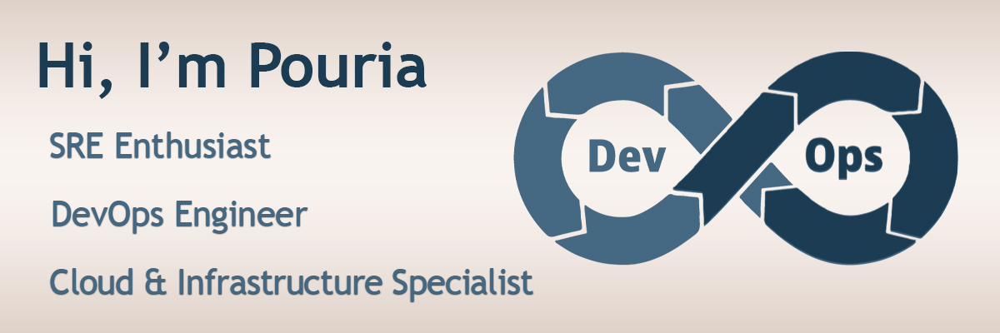

### 👨‍💻 About Me
- 🔧 Passionate about **Cloud Infrastructure, Automation, and Reliability Engineering**
- ☁️ Experienced with **Cloud-Native Tools, Hybrid Cloud & Open-Source Infrastructure**
- 📦 Skilled in **Kubernetes, Docker, Docker Swarm**
- 🌱 Exploring **IaC tools (Terraform, Ansible)**
- 📈 Interested in **Monitoring, Observability & SRE Practices**
- ⚙️ Focused on building **scalable, reliable, and secure infrastructure**
- 🚀 Always curious, **learning**, and **improving** in the world of **DevOps |‌ Cloud | SRE**
